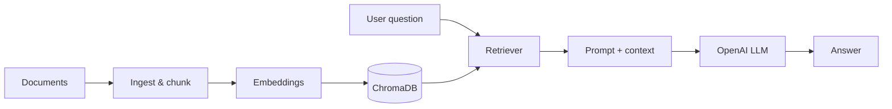

# Agentic RAG Knowledge App

A Retrieval-Augmented Generation (RAG) application that answers questions from
your own documents instead of relying only on a model's training data. It
combines an LLM with a vector store so responses are grounded in retrieved,
relevant context, and supports conversational memory.

## Features

- Conversational AI chatbot with memory
- Retrieval-Augmented Generation (RAG) over uploaded documents
- Vector database using ChromaDB
- LangChain orchestration
- OpenAI GPT integration
- Document-based question answering

## Tech Stack

- Python
- LangChain
- OpenAI API
- ChromaDB
- Flask / FastAPI
- HuggingFace embeddings

## Project Structure

```
.
├── app/
│   ├── services/      # RAG, LLM, and vector-store logic
│   ├── models/        # Data models
│   ├── templates/     # HTML templates
│   ├── static/        # Static assets
│   ├── config.py      # Configuration
│   └── main.py        # App entry point
└── requirements.txt
```

## Architecture



**Skills demonstrated:** document ingestion & chunking, embeddings, vector retrieval (ChromaDB), prompt construction, and LLM orchestration with LangChain.

## Setup

```bash
python -m venv .venv && source .venv/bin/activate   # Windows: .venv\Scripts\activate
pip install -r requirements.txt
cp .env.example app/.env      # then add your keys
```

## Run

```bash
python app/main.py
```

## Configuration

Secrets are read from `app/.env` (git-ignored). See `.env.example` for the
required keys (OpenAI and AWS S3). Never commit real credentials.

## License

Released under the [MIT License](LICENSE).
